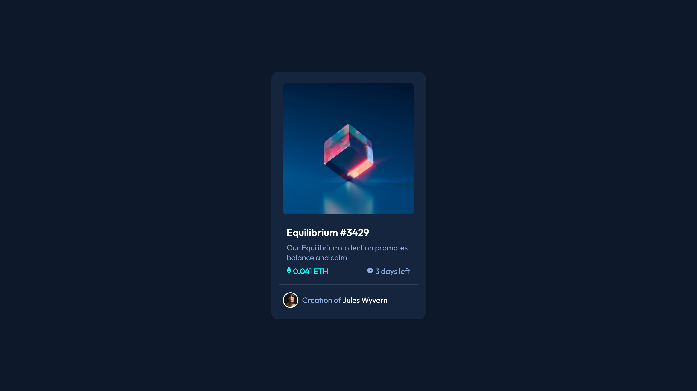
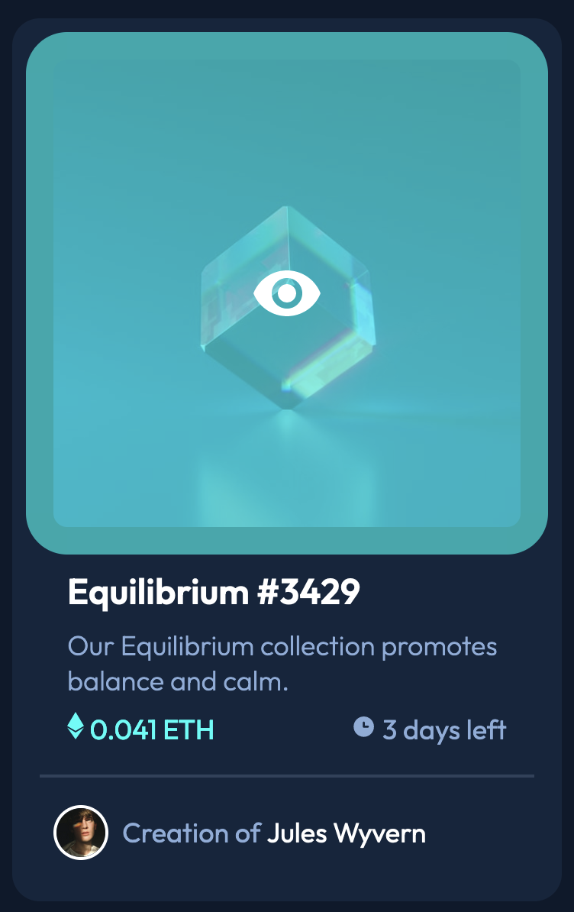
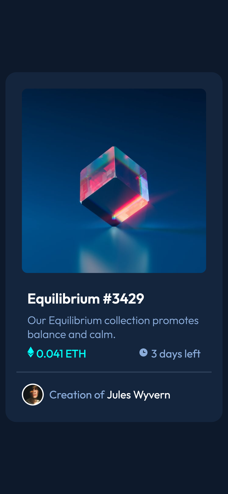

# Frontend Mentor - NFT preview card component solution

This is a solution to the [NFT preview card component challenge on Frontend Mentor](https://www.frontendmentor.io/challenges/nft-preview-card-component-SbdUL_w0U). Frontend Mentor challenges help you improve your coding skills by building realistic projects.

## Table of contents

- [Overview](#overview)
  - [The challenge](#the-challenge)
  - [Screenshot](#screenshot)
  - [Links](#links)
- [My process](#my-process)
  - [Built with](#built-with)
  - [What I learned](#what-i-learned)
  - [Continued development](#continued-development)
  - [Useful resources](#useful-resources)
- [Author](#author)
- [Acknowledgments](#acknowledgments)

**Note: Delete this note and update the table of contents based on what sections you keep.**

## Overview

### The challenge

Users should be able to:

- View the optimal layout depending on their device's screen size
- See hover states for interactive elements

### Screenshot





### Links

- Solution URL: [GitHub](https://github.com/LySabrina/NFT-Card)
- Live Site URL: [Live Solution](https://your-live-site-url.com)

## My process

### Built with

- Semantic HTML5 markup
- CSS custom properties
- Flexbox
- Mobile-first workflow

### What I learned

During this project, I learned more on structuring the HTML so that I can better format with Flexbox.
Additionally, I needed to learn how to overlay the image with a transparent color. I learned that you can do this by using a `<div>` and display it when hovering over the image.

```html
<div class="img-container">
  
  <div class="view">
    
  </div>
</div>
```

Above code, shows how I needed to update the HTML to allow a `<div>` so that when hovering, it will display a transparent coral overlay.

Additionally, I needed a way to have the price and the days left formatted. I realized I can use a `<span>` inside the `<p>` since spans can be used to style certain text inside a paragraph tag. Having the img tag inside the paragraph tag allowed it easier to use flexbox on the container to format the child flex-elements.

```html
<div class="price-container">
  <p class="price">
    <span></span>
    0.041 ETH
  </p>

  <p class="count-down">
    <span></span>
    3 days left
  </p>
</div>
```

```css
.img-container {
  position: relative;
  display: flex;
  justify-content: center;
  align-items: center;
}

.img-container:hover .view {
  cursor: pointer;
  display: flex;
  background: hsl(178, 100%, 50%, 0.6);
}

.view {
  position: absolute;
  width: 100%;
  height: 100%;
  display: flex;
  justify-content: center;
  align-items: center;
  display: none;
}
```

Above shows how I went about showing the coral overlay on the image. I learned that you can style certain classes after the psuedo-classes (:hover).

Additionally, I used position so that the eye is absolute. Once I did that, I can easily center the eye in the middle of the image.

```css
.info {
  margin: 0px 0.5em 0.5em 0.5em;
  padding: 0.5em;
  border-bottom: 2px solid var(--c-card-line);
}

.info > * {
  margin: inherit;
}

.info > h1 {
  color: var(--c-white);
  font-size: 1.3rem;
  margin: inherit;
}
```

Finally, I tried to inherit the margins and paddings. I did this so all the elements inside the info container are lined up properly.

### Continued development

Overall, I am satisfied with the final design. There are some pixels that are off from the original design but overall, the whole design looks similar.

### Useful resources

- [StackOverFlow](https://stackoverflow.com/questions/21086385/how-to-make-in-css-an-overlay-over-an-image) - This helped me approach creating the coral overlay over the image.

## Author

- Frontend Mentor - [@lysabrina](https://www.frontendmentor.io/profile/LySabrina)
- GitHub - [@lysabrina](https://github.com/LySabrina)

## Acknowledgments

Thanks to FrontendMentor for these projects. And me!.
